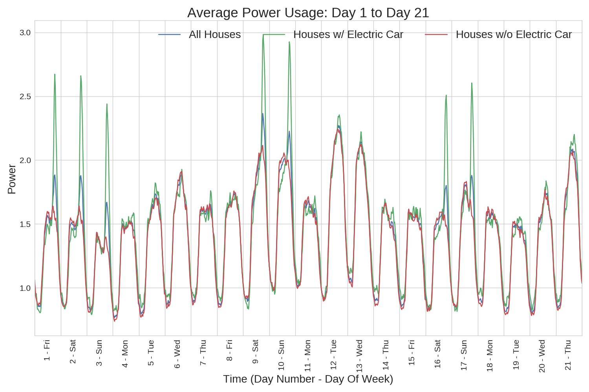

# Electric Vehicle Detection

## Abstract
This project and data set came from the Boulder, CO based company, <a href="https://www.gridcure.com/">GridCure<a>.
The training data contains smart meter power readings for 1,590 houses over a 60
day time span at half-hour time intervals.  Along with the power readings, there
is a set of binary data labels for each house and time interval that identify whether
or not an electric vehicle is charging.  The goal is to develop a model that predicts
the probability that an electric vehicle is charging on a test data set with
power readings for 699 houses across the same time intervals.  The full description
of the problem provided by GridCure can be seen <a href="https://github.com/jbhersch/electric_car/blob/master/data/README.md">here</a>.

## Data Exploration
A good place to start when examining general trends in the relationship between
power usage and when electric vehicles are being charged is to examine the average
power usage and the total number of houses with vehicles charging at every time
increment in the training data.  This is shown in the plot below, with the average
power usage shown in blue and the number of vehicles charing shown in red.

The x-axis grid lines separate days across the time span and it is clear that
the spikes in the number of cars that are charging tend to occur in two day bursts.
These spikes most likely indicate the weekends, which is a trend in the data that
will be examined in more detail.  Another aspect of this plot to notice is that
spikes in power usage don't necessarily indicate spikes in the number of cars
being charged.  

The next plot compares the average power usage of all houses with the average power
usage of houses with electric vehicles and the average power usage of houses without
electric vehicles.  Similar to the previous plot, there are clear two day power spikes
that occur periodically throughout the time span that are captured by the averages on
all the houses and the houses with electric cars.  

Since there are so many time intervals in this data set (2,880 half hour intervals),
the behavior of the average power consumption is easier to describe when examined
over smaller time intervals.  The next three plots once again show the average
power for all houses, houses with electric cars, and houses without electric cars,
but they are broken up into periods of roughly three weeks.  

The plot describing day 1 to day 21 is shown first.  Notice that the first three days
all show spikes in power usage for houses with electric vehicles.  This most likely
indicates that day 1 was a Friday and also a holiday.  The remaining four days with
power spikes on houses with electric vehicles would fall on Saturdays and Sundays
under the assumption that day 1 is a Friday.

Looking at day 22 to day 42, the hypothesis that the power spikes occur on weekends
and that day 1 is a Friday appears to hold true.  If day 1 is a Friday, then day 22
would also be a Friday, and notice there is not a spike on day 22.  However, days 23
and 24, which would be Saturday and Sunday respectively, do show power spikes.  Furthermore,
there are four more power spikes in the last two weeks shown in the plot and they
also fall on weekends assuming that day 1 is a Friday.

The final average power usage plot showing day 43 to 60 continues to support the
weekend power spike hypothesis.  Eighteen days are shown here (as opposed to the
21 days shown in the previous two plots) with six of them showing power spikes,
all of which occur on weekends following the assumption that day 1 is a Friday.
Breaking the average power usage plots into three periods of roughly three weeks
provides strong evidence to support the hypothesis that the first day of power usage
shown in the data is a Friday, which happened to be a holiday, and that people
tend to charge their electric vehicles in higher volume on the weekends.

## Model Building

## Model Performance

