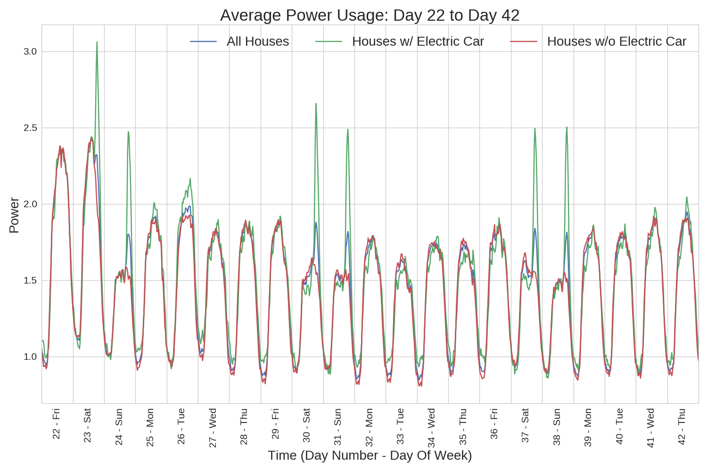

# Electric Vehicle Detection

## Abstract
This project and data set came from the Boulder, CO based company, <a href="https://www.gridcure.com/">GridCure<a>.
The training data contains smart meter power readings for 1,590 houses over a 60
day time span at half-hour time intervals.  Along with the power readings, there
is a set of binary data labels for each house and time interval that identify whether
or not an electric vehicle is charging.  The goal is to develop a model that predicts
the probability that an electric vehicle is charging on a test data set with
power readings for 699 houses across the same time intervals.  The full description
of the problem provided by GridCure can be seen <a href="https://github.com/jbhersch/electric_car/blob/master/data/README.md">here</a>.

## Data Exploration
A good place to start when examining general trends in the relationship between
power usage and when electric vehicles are being charged is to examine the average
power usage and the total number of houses with vehicles charging at every time
increment in the training data.  This is shown in the plot below, with the average
power usage shown in blue and the number of vehicles charing shown in red.

The x-axis grid lines separate days across the time span and it is clear that
the spikes in the number of cars that are charging tend to occur in two day bursts.
These spikes most likely indicate the weekends, which is a trend in the data that
will be examined in more detail.  Another aspect of this plot to notice is that
spikes in power usage don't necessarily indicate spikes in the number of cars
being charged.  

The next plot compares the average power usage of all houses with the average power
usage of houses with electric vehicles and the average power usage of houses without
electric vehicles.  Similar to the previous plot, there are clear two day power spikes
that occur periodically throughout the time span that are captured by the averages on
all the houses and the houses with electric cars.  

Since there are so many time intervals in this data set (2,880 half hour intervals),
the behavior of the average power consumption is easier to understand when broken
up into smaller time frames.  The next three plots once again show the average
power for all houses, houses with electric cars, and houses without electric cars,
but they are broken up into periods of roughly three weeks.  

The plot describing day 1 to day 21 is shown first.  It is not explicitly
mentioned that day 1 is a Friday, but it is labeled as such in this plot.
This is because if it is assumed that day 1 is a Friday, then all the days with
power spikes would fall on weekend days, with the exception of day 1, which was
probably a holiday.  The idea that people charge their electric vehicles at a
higher rate on the weekends makes sense intuitively because people tend to spend
more time at home on the weekends, and it stands to reason that people charge their
electric vehicles when they are home.

Looking at day 22 to day 42, the hypothesis that the power spikes occur on weekends
and that day 1 is a Friday appears to hold true.  If day 1 is a Friday, then day 22
would also be a Friday, and notice there is not a spike on day 22.  However, days 23
and 24, which would be Saturday and Sunday respectively, do show power spikes.  Furthermore,
there are four more power spikes in the last two weeks shown in the plot and they
also fall on weekends assuming that day 1 is a Friday.

The final average power usage plot showing day 43 to day 60 continues to support the
weekend power spike hypothesis.  Eighteen days are shown here (as opposed to the
21 days shown in the previous two plots) with six of them showing power spikes,
all of which occur on weekends following the assumption that day 1 is a Friday.
Breaking the average power usage plots into three periods of roughly three weeks
provides strong evidence to support the hypothesis that the first day of power usage
shown in the data is a Friday, which happened to be a holiday, and that people
tend to charge their electric vehicles in higher volume when they are home on the weekends.

## Model Building
#### Feature Engineering
The primary goal of this project is to calculate the probability
that an electric car is charging at every time interval for all the houses in
the test data.  Six features in addition to the power readings are constructed
for each house at each time interval which are discussed in detail below.  
Suppose there are N houses with power readings at M time intervals that exist
within an NxM matrix.  The training data contains another NxM matrix with the
binary labels of whether or not an electric vehicle is charging for the same N
houses at the same M time intervals.  Since there are seven total features
(the power reading and the six engineered features) at each interval, the feature
matrix used in the machine learning model will have NxM rows and seven columns.
The label matrix is then transformed into NxM target vector.  This process takes
place in the file, <a href="https://github.com/jbhersch/electric_car/blob/master/feature_engineering.py">feature_engineering.py</a>.

Examining the power plots for individual houses with the charge points labeled
reveals that oftentimes charging occurs above some power threshold that can be
visually identified by a spike in power.  However, it also happens fairly
frequently that charge points exist before and/or after a power spike occurs.  
This most likely occurs when the electric vehicles are plugged in at the end
of a time interval or unplugged at the beginning of a time interval.  As a result,
these time intervals are labeled as charge points because the vehicles are charging,
but they are not charging long enough within the interval to contribute a significant
change in the overall power reading.  As a result, examining a numerical approximation
to the first derivative can capture significant increases and decreases at time intervals
where the vehicles are not charging long enough to significantly change the power
reading itself.  In order to capture this behavior, the first derivative at each
power reading is approximated using three different methods: the forward derivative,
the backward derivative, and the inside derivative.  

Another thought I had was to examine the second derivative of the power reading.
For a continuous function, inflection points occur when the second derivative is
equal to zero.  The relevant property of inflection points for the purpose of
this model is that inflection points identify a shift in concavity, which in
this case, could signal that the status of an electric vehicle charging might be
in close proximity to time intervals with second derivatives that are close to
zero.  Clearly these power readings are not continuous functions, but approximating
the second derivative numerically might provide a means for the machine learning
models to identify inflection points and better predict the probability that
an electric vehicle is charging in the test data.  Similar to the case of the
first derivative, the second derivatives are approximated using the forward,
backward, and inside methods, which are formally defined below:

Let p[n] be the power reading for an arbitrary house at interval n.

##### Forward Derivatives
dp1_forward[n] = p[n+1] - p[n]

dp2_forward[n] = dp1_forward[n+1] - dp1_forward[n]

##### Backward Derivatives
dp1_back[n] = p[n] - p[n-1]

dp2_back[n] = dp1_back[n] - dp1_back[n-1]

##### Inside Derivatives
dp1_inside[n] = (p[n+1] - p[n-1])/2

dp2_inside[n] = (dp1_inside[n+1] - dp1_inside[n-1])/2

## Model Performance

